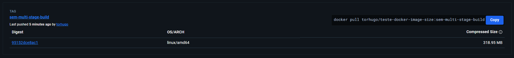
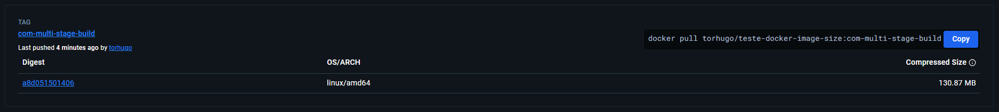

# 🚀 Otimizando Imagem Docker com Multi-Stage Build 🚀
Sem dúvida alguma, este é um tópico muito importante quando pensasmos em serviços grandes e escaláveis. <br/></br>
Não só pelo fato de você conseguir gerar imagens mais leves, rapidas e seguras, mas também, pelo simples fato que isso pode ter um impacto significante no custo de serviços Cloud. <br/></br>
Como, por exemplo, o ECR (**Amazon Elastic Container Registry**) é um serviço da AWS para armazenar e gerenciar imagens Docker, que na minha concepção, é bem semelhante ao Docker Hub. Este serviço, tem uma grande importancia pensando na AWS, principalmente por ter a possibilidade de ser integrado há outros serviços, como, Amazon Elastic Container Service (Amazon ECS), Amazon Elastic Kubernetes Service (Amazon EKS) e ao AWS Lambda. <br/></br>
Porém, é importante destacar que uma das formas de cobrança do ECR, é pelo armazenamento da imagem Docker. Ou seja, quanto maior for o tamanho da sua imagem Docker, mais espaço ela ocupara do serviço e consequentemente mais caro será o valor final.

Abaixo, está uma evidência comprobatoria da eficaz da utilização de multi-stage build no processo de criação de imagem Docker.

> ❗ Para ambas as imagens, foram utilizado o mesmo projeto backend, uma API com diversas funcionalidades e integrações, escrita em Java com SpringBoot. [Link do repositório](https://github.com/TorHugo/notification-user-api).
### Dockerfile (sem multi-stage-build)


```dockerfile
FROM openjdk:21
WORKDIR /app
COPY build/libs/notification-user-api.jar /app/notification-user-api.jar
EXPOSE 8081
```
Características desta abordagem:

1. Simplicidade: O Dockerfile é conciso e fácil de entender.
2. Build Externo: Assume que o JAR já foi compilado previamente.
3. Tamanho da Imagem: Resulta em uma imagem maior, pois inclui o JDK completo.

### Dockerfile (com multi-stage-build)


```dockerfile
FROM eclipse-temurin:21-jdk-alpine AS builder
WORKDIR /app
COPY . .
RUN ./gradlew build -x test

FROM eclipse-temurin:21-jre-alpine
WORKDIR /app
COPY --from=builder /app/build/libs/notification-user-api.jar ./app.jar
EXPOSE 9000
ENTRYPOINT ["java", "-jar", "app.jar"]
```
O multi-stage build funciona da seguinte forma:

- No primeiro estágio, o ambiente completo de build é preparado e a aplicação é compilada.
- No segundo estágio, apenas o artefato necessário (o JAR compilado) é copiado do primeiro estágio.

O resultado final é uma imagem que contém apenas o JRE e o JAR da aplicação, sem incluir todo o ambiente de build.

**Principais vantagens**:

1. Tamanho reduzido: A imagem final não inclui as ferramentas de build, apenas o necessário para executar a aplicação.
2. Segurança melhorada: Menos componentes na imagem final significam menos potenciais vulnerabilidades.
3. Clareza: O processo de build e a configuração do ambiente de execução estão claramente separados.

> Docker Hub, contendo ambas as imagens: [docker-hub](https://hub.docker.com/r/torhugo/teste-docker-image-size/tags)

### Conclusão
Os resultados dos testes demonstram claramente a eficácia do multi-stage-build para a geração da imagem docker, proporcionando uma redução significativa principalmente no tamanho da imagem. 

### 👨‍🚀 Team Members
Developed by `Arruda, Victor Hugo`!

### 📨 Contacts
- [LinkedIn](https://www.linkedin.com/in/victorhugodev/)
- [Email](mailto:contato.arrudavictor@gmail.com)